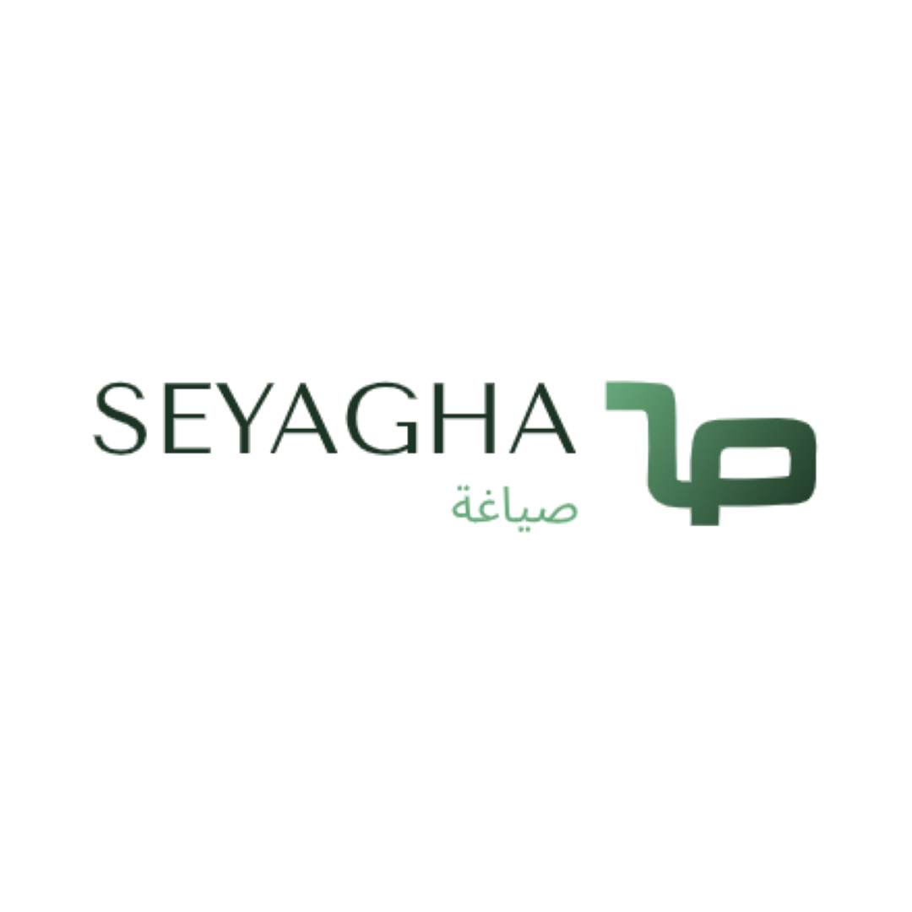

# Seyagha: Arabic Paraphrasing Solution 

Seyagha is a **Web Extension** for arabic text paraphrasing, powered by state-of-the-art NLP techniques like the **t5-arabic-text-summarization** transformer model _(for paraphrasing)_, **AraBERT** model _(for keyword extraction)_ and **WordNet** _(for synonym finding)_.

## Demo

Here is a working demo of the Seyagha extension on Microsoft Edge:

***

Created with ❤️ by <a href="https://www.linkedin.com/in/taha7ussein/">Taha Hussein</a>

